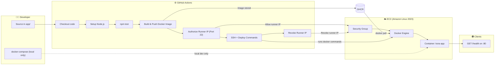

# DeployReady — Kora Analytics APP

This folder contains **Kora Analytics**’ small Node.js API under [`app/`](./app/) plus everything needed to **build a container**, **run it locally with Compose**, **ship it through GitHub Actions to GHCR**, and **run it on AWS EC2** behind Docker. Application logic in `app/` is unchanged

---

Clone this infrastructure blueprint to your local machine and navigate to the DeployReady directory:
```bash
git clone [https://github.com/emmiduh/AmaliTech-DEG-Project-based-challenges.git](https://github.com/emmiduh/AmaliTech-DEG-Project-based-challenges.git)
cd AmaliTech-DEG-Project-based-challenges/dev-ops/DeployReady
```

## Architecture overview



- **Runtime:** Node.js 20 listens on `PORT` (default `3000` inside the container).
- **Local:** `docker-compose.yml` builds the image from this directory’s `Dockerfile`, loads `.env`, maps **host `3000` → container `3000`*.
- **CI/CD:** [`.github/workflows/deploy.yml`](../../.github/workflows/deploy.yml) (repository root) runs **test → build → push → deploy** on every push to **`main`**. Images are pushed to **GitHub Container Registry** as `ghcr.io/<lowercase owner>/<lowercase repo>:<sha>` and `:latest`. Deploy uses **SSH** to pull that SHA tag and restart a container named **`kora-analytics-api`** with **`-p 80:3000`** so the public submission check hits **`http://<ec2-ip>/health`**.
- **Infrastructure (bonus):** Optional Terraform under [`terraform/`](./terraform/) provisions a **t2.micro** Amazon Linux 2023 instance, security group (**80** from `0.0.0.0/0`, **22** from your CIDR), and installs Docker on first boot.

For EC2 console steps, Docker commands on the host, security group rules, verification `curl`, and logs, see **[`DEPLOYMENT.md`](./DEPLOYMENT.md)**.

---

## Repository layout

| Path | Purpose |
| ---- | ------- |
| [`app/`](./app/) | Node API (`index.js`, tests, `package.json`) — **do not change app logic for the challenge** |
| [`Dockerfile`](./Dockerfile) | Production-oriented image: `node:20-alpine`, `npm ci`, non-root `node` user |
| [`docker-compose.yml`](./docker-compose.yml) | Service **`app`**: build, `env_file: .env`, `3000:3000`, `unless-stopped` |
| [`.env.example`](./.env.example) | Example `PORT=3000` (copy to `.env`; `.env` is gitignored) |
| [`.dockerignore`](./.dockerignore) | Keeps `node_modules` and secrets out of the build context |
| [`DEPLOYMENT.md`](./DEPLOYMENT.md) | AWS EC2, Docker on AL2023, GHCR pull/run, verification, logs, Terraform usage |
| [`terraform/`](./terraform/) | **Bonus:** Terraform for EC2 + security group + Docker `user_data` |
| [`.github/workflows/deploy.yml`](../../.github/workflows/deploy.yml) | Workflow lives at **repo root** (GitHub requirement) |

---

## Setup — local (Docker)

From **`dev-ops/DeployReady`**:

```bash
cp .env.example .env
docker compose up --build
```

Verify:

```bash
curl -sS http://localhost:3000/health
```

Expected: `{"status":"ok"}`.

Optional (without Docker), from `app/`:

```bash
npm install
npm test
npm start
```

---

## Setup — Infrastructure as Code (Terraform Bonus)

Instead of manually clicking through the AWS Console, this project includes a Terraform configuration to automatically provision the EC2 instance, configure the Security Group, and bootstrap the Docker engine.

### Prerequisites
* [Terraform](https://developer.hashicorp.com/terraform/downloads) installed locally.
* [AWS CLI](https://aws.amazon.com/cli/) installed and configured (`aws configure` with an admin user).

### Execution Steps
1. **Navigate to the Terraform directory:**
   ```bash
   cd terraform/

2. **Initialize the working directory:**
   ```bash
   terraform init

3. **Review the execution plan (Verifies what AWS resources will be created):**
   ```bash
   terraform plan

4. **Apply the configuration: (Provisions the infrastructure)**
   ```bash
   terraform apply

5. **Collect Outputs:** Once complete, Terraform will output the public IP of the new EC2 instance. Copy this IP address to use as your EC2_HOST in the GitHub Actions secrets.
---

## Setup — CI/CD and cloud

### 1. GitHub Repository Secrets
Navigate to **Settings → Secrets and variables → Actions** and configure the following:

| Secret | Role |
| :--- | :--- |
| `SSH_PRIVATE_KEY` | **ED25519** Private key for `ec2-user` (Must include the full multiline PEM format) |
| `EC2_HOST` | Instance public IPv4 address |
| `EC2_USER` | `ec2-user` (Default for Amazon Linux 2023) |
| `GHCR_TOKEN` | GitHub PAT with `read:packages` permission to allow the EC2 server to pull the image |
| `AWS_ACCESS_KEY_ID` | IAM Pipeline User access key |
| `AWS_SECRET_ACCESS_KEY` | IAM Pipeline User secret key |
| `AWS_REGION` | AWS Region of the EC2 instance (e.g., `eu-west-1`) |
| `AWS_SG_ID` | The exact Security Group ID attached to the EC2 instance (e.g., `sg-08ec...`) |

### 2. IAM Pipeline Permissions (Least Privilege)
The AWS credentials provided above belong to a dedicated IAM user (e.g., `github-actions-pipeline`). To strictly follow the principle of least privilege, this user does not need full AWS access. It only requires the ability to modify the specific security group during deployment:
* `ec2:AuthorizeSecurityGroupIngress`
* `ec2:RevokeSecurityGroupIngress`

### 3. EC2 Initialization
Before the pipeline runs for the first time, ensure your EC2 instance is prepared (or use the provided Terraform script):
* **Docker:** Must be installed, enabled, and running. The `ec2-user` must be added to the `docker` group.
* **Firewall (Security Group):** Port **80** must be open to `0.0.0.0/0` to serve the API. Port **22** can be locked exclusively to your personal local IP for manual admin access. **Do not open Port 22 to the world.** The CI/CD pipeline will automatically inject and revoke its own IP address during the deployment phase.

### 4. Triggering the Deployment
1. Ensure the `GHCR_TOKEN` belongs to the `github.repository_owner` (or adjust the `username` in the deploy workflow accordingly).
2. Push your code to the `main` branch.
3. Navigate to the **Actions** tab in GitHub. You will watch the runner authenticate, build the Docker image, dynamically open the AWS firewall, deploy the container, and securely lock the firewall behind it.


---

## Decisions made

| Topic | Choice | Rationale |
| ----- | ------ | --------- |
| Base image | `node:20-alpine` | Small image, matches Node 20 used in CI |
| Dependency install | `npm ci --omit=dev` | Reproducible production install; devDependencies (Jest) stay out of the runtime image |
| Lockfile | `COPY app/package*.json ./` +  `npm ci --omit=dev` | Ensures a clean, deterministic build using exact versions from the lockfile without installing unnecessary devDependencies. |
| Non-root | `USER node` + `chown -R node:node` after install | `npm ci` as root leaves `node_modules` owned by root; `chown` lets `npm start` run safely |
| Workflow location | Repo root `.github/workflows/` | GitHub Actions only loads workflows from the repository root |
| Image name | `ghcr.io/<lowercase full repository>` | GHCR requires lowercase paths |
| Deploy transport | `appleboy/ssh-action@v1.0.3` | Provides a stable, community-tested Action for executing remote Docker commands via SSH, avoiding fragile bash heredocs. |
| Pipeline Security | Dynamic Security Group Ingress | Instead of leaving Port 22 permanently open to 0.0.0.0/0 or GitHub's massive IP ranges, the pipeline uses an IAM user to inject the runner's specific IP into the firewall for 60 seconds, and guarantees revocation using an if: always() step. |
| Instance type | t3.micro | t2.micro is not availble as a free-tier instance  |
| Bonus | Terraform EC2 + SG | Repeatable infra, aligns with “console or Terraform” in the brief; documented in `DEPLOYMENT.md` |

---

