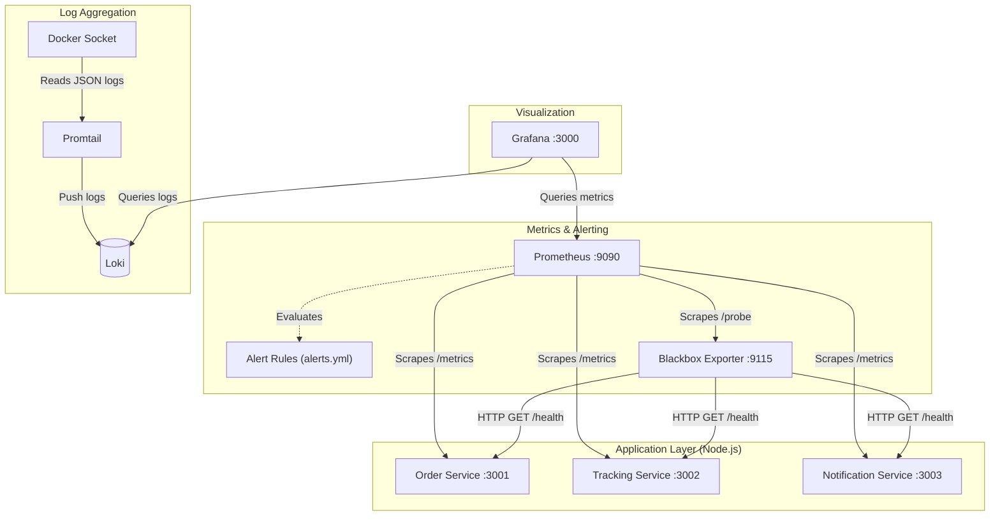
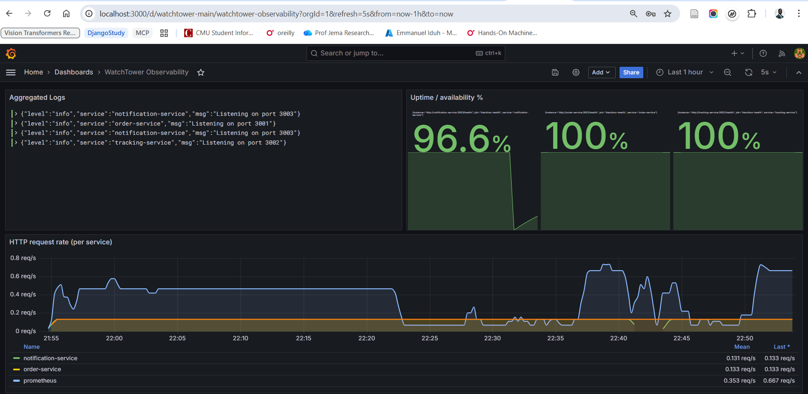
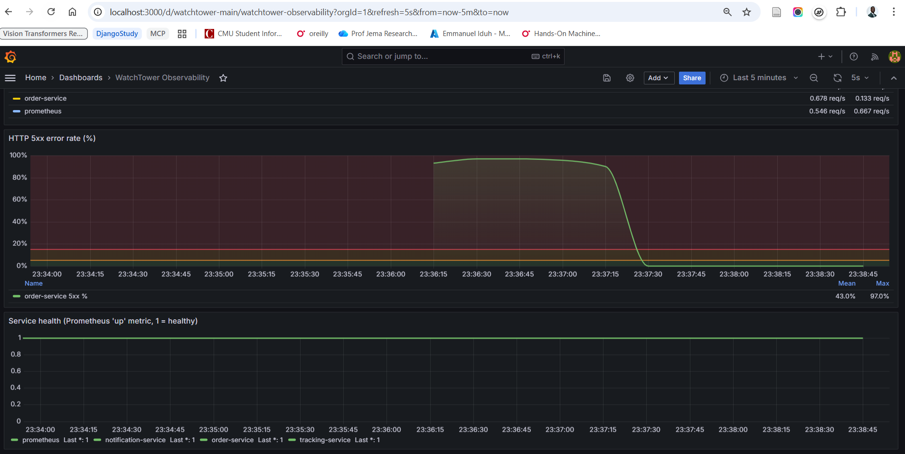

# WatchTower — Observability Stack & Logging Stack (Prometheus + Grafana + Loki)

Reyla Logistics runs three Node.js microservices (`order-service`, `tracking-service`, `notification-service`). This repository implements a  **production-style observability stack** with the three core pillars of observability—Metrics, Alerts, and Logs—using a fully containerized Prometheus, Grafana, and Loki stack with zero-touch automated provisioning.

---

## 1. Architecture diagram (ASCII)



**Flow**

1. Each service exposes **`/metrics`** (Prometheus format) and **`/health`** (JSON).
2. **Prometheus** scrapes `/metrics` on a **15s** interval from all services over the Docker **`observability`** network using **service DNS names** (e.g. `order-service`, not `localhost`).
3. Prometheus also scrapes the **Blackbox Exporter**, which **HTTP checks** on **`/health` oendpoints** to validate real service availability (including non-200 responses).
4. Prometheus evaluates **Alert rules** defined in `prometheus/alerts.yml` based on collected metrics and probe results.
5. **Grafana** connects to Prometheus as a **provisioned datasource** and loads dashboards automatically at startup.
6. (Bonus) Promtail collects container logs and pushes them to Loki, which Grafana queries for log visualization.

> **Why Blackbox?** The coursework asks for alerts when **`/health` is not HTTP 200**. Prometheus’ `up` metric only reflects **successful scrapes of `/metrics`**, so a broken `/health` with a healthy `/metrics` would be invisible. Blackbox closes that gap.

---

## 2. Repository layout

```
WatchTower/
├── docker-compose.yml
├── .env.example
├── blackbox/
│   └── blackbox.yml
├── prometheus/
│   ├── prometheus.yml
│   └── alerts.yml
├── grafana/
│   ├── provisioning/
│   │   ├── datasources/prometheus.yaml
│   │   └── dashboards/watchtower.yaml
│   └── dashboards/
│       └── dashboard.json
└── app/…                     # (unchanged logic)
```

---

## 3. Setup instructions

### 3.1 Prerequisites

- Docker Engine + Docker Compose v2

### 3.2 Clone repo and Launch the stack

```bash
git clone "https://github.com/emmiduh/AmaliTech-DEG-Project-based-challenges"
cd dev-ops/WatchTower
cp .env.example .env
docker compose up --build
```

### 3.3 Verify Prometheus

1. Open **http://localhost:9090** (or `${PROMETHEUS_HOST_PORT}` if you changed it).
2. Navigate to **Status → Targets**. You should see **`order-service`**, **`tracking-service`**, **`notification-service`**, **`blackbox-health`**, and **`prometheus`** in **UP** state (green) after ~30–60 seconds.
3. Click on **Alerts** to see the alerts status.

### 3.4 Verify Grafana

1. Open **http://localhost:3000** (or `${GRAFANA_HOST_PORT}`).
2. Sign in with **`GF_SECURITY_ADMIN_USER` / `GF_SECURITY_ADMIN_PASSWORD`** from `.env`.
3. Open **Dashboards → WatchTower Observability** (UID `watchtower-main`). It should appear **without manual import** thanks to provisioning.

---

## 4. Dashboard walkthrough (`grafana/dashboards/dashboard.json`)

| Panel | What it shows | PromQL idea |
| ----- | --------------- | ----------- |
| **HTTP request rate (per service)** | Throughput across all instrumented routes, split by Compose/`job` name. | `sum by (job) (rate(http_requests_total[$__rate_interval]))` |
| **HTTP 5xx error rate (%)** | Percentage of responses whose `status` label matches `5xx` for each `job`. Uses `clamp_min` to avoid divide-by-zero when a service is idle. | `100 * sum(rate(...5xx...)) / clamp_min(sum(rate(...)), 1e-9)` |
| **Service health** | Step chart of **`probe_success`** (1 healthy, 0 failing) per `service` label extracted from the probe URL. | `probe_success{job="blackbox-health"}` |
| **Uptime/availability %** | Approximate “uptime” as **`avg_over_time(probe_success[1h]) * 100`** for each microservice. | `avg_over_time(probe_success{job="blackbox-health", service=~"order-service\|tracking-service\|notification-service"}[24h]) * 100` |

> **Screenshots of Grafana Dashboards**.
  
  
---

## 5. Alert testing (how to simulate each condition)

All rules live in **`prometheus/alerts.yml`** and are evaluated by Prometheus (view **Alerts** in the Prometheus UI).

### 5.1 `ServiceDown` (critical) — `/health` not HTTP 200 for >1 minute

**Rule condition:** Triggers when `probe_success{job="blackbox-health"} == 0` for **1 minute**.

**Simulate**

```bash
# Stop one service; Blackbox and metrics scrapes both fail for that target.
docker compose stop order-service
```

Wait **>1 minute**, then check **Prometheus → Alerts**. Restore with `docker compose start order-service`.

### 5.2 `HighErrorRate` (warning) — >5% 5xx over 5 minutes

**Rule condition:** Triggers when 5xx responses exceed **5% of total requests** over **5 minutes**.

**Simulate**

1. Add a **temporary** `/chaos/500` route in `app/order-service/index.js` in a test branch to emit real `500 Internal Server Error`  responses.
  ```javascript
  // TEMPORARY CHAOS ROUTE FOR ALERT TESTING
  app.get('/chaos/500', (req, res) => {
    // This forces a 500 status code which the middleware above will record
    res.status(500).json({ error: 'Simulated Internal Server Error!' });
  });
  ```

2. Rebuild the `order-service` image so it copies your new, modified index.js file into the container: `docker compose up -d --build order-service`

3. Launch a bash traffic cannon to trigger the threshold: `while true; do curl -s http://localhost:3001/chaos/500 > /dev/null; echo -n "💥 "; sleep 0.1; done`

Within 15–30 seconds, the "HTTP 5xx error rate (%)" panel will aggressively spike in Grafana. 
Check **Prometheus → Alerts**. The alert will enter the PENDING state almost immediately. Leave the traffic cannon running for exactly 5 minutes to see the alert officially transition to FIRING.

### 5.3 `ServiceNotScraping` (warning) — no metrics scrape for >2 minutes

**Rule condition:** Triggers when Prometheus cannot scrape a service (up == 0) for 2 minutes. for **2 minutes**.

**Simulate**

```bash
docker compose stop tracking-service
```

After **2 minutes**, Prometheus marks the `tracking-service` target as down (`up==0`) and the alert should move to **pending/firing**.

---

## 6. Logging (JSON file driver + commands)

All containers are configured to use Docker's `json-file` logging driver with a strict rotation policy (max-size: "10m", max-file: "5") to prevent disk exhaustion. The configuration was defined in the `x-logging` block of the docker-compose.yml file

### 6.1 View live logs (all services)

```bash
docker compose logs -f
```

**Sample log output**

```text
loki-1                  | level=info ts=2026-04-25T21:53:38.938052089Z caller=checkpoint.go:498 msg="atomic checkpoint finished" old=/loki/wal/checkpoint.000022.tmp new=/loki/wal/checkpoint.000022
loki-1                  | level=info ts=2026-04-25T21:53:38.93854534Z caller=checkpoint.go:569 msg="checkpoint done" time=4m30.018754762s
```

Each line is wrapped by Docker as JSON (fields such as `log`, `stream`, `time`)—easy to forward to Loki/ELK later.

### 6.2 Filter errors for one service

```bash
docker compose logs order-service | grep -i error
```

**Sample output**

```text
grafana-1               | logger=authn.service t=2026-04-25T19:55:01.688789777Z level=warn msg="Failed to authenticate request" client=auth.client.session error="user token not found"
```

> **Note:** the apps primarily log **info** JSON to stdout; the `grep` command is still the standard operator workflow when errors exist.
```text
docker compose logs order-service | grep -i "info"
order-service-1  | {"level":"info","service":"order-service","msg":"Listening on port 3001"}
```

---

## 7. Bonus — Loki Integration

To eliminate the need for terminal-based log parsing, this stack integrates `Promtail` and `Loki`. Promtail dynamically mounts the Docker socket, automatically tagging logs with the com.docker.compose.service metadata. This creates absolute label parity between Prometheus (metrics) and Loki (logs), enabling instant correlation inside Grafana.

---

## 8. Key design decisions

## 8. Key Design Decisions

| Decision | Architectural Reasoning |
| :--- | :--- |
| **Dedicated `observability` bridge network** | Ensures stable DNS resolution (`order-service`, `prometheus`, etc.) and provides isolation, avoiding the unpredictability of the `default` bridge. |
| **Blackbox Exporter for `/health`** | Satisfies strict “non-200 health” alerting requirements using synthetic probes, keeping the core Node.js services completely untouched by monitoring logic. |
| **Separate jobs per microservice** | Aligns the Prometheus `job` label perfectly with Docker Compose service names, enabling much simpler `sum by (job)` aggregation in Grafana. |
| **`json-file` logging + rotation** | Controls disk growth on host machines and CI runners while preserving structured JSON envelopes for seamless downstream ingestion by Promtail/Loki. |
| **Provisioned Grafana** | Eliminates manual UI configuration for datasources and dashboards, adhering strictly to modern "Infrastructure as Code" and GitOps workflows. |
| **Rich Alert Annotations** | Every alert rule carries explicit `summary` and `description` fields, providing immediate context for on-call engineers and paging systems. |

---