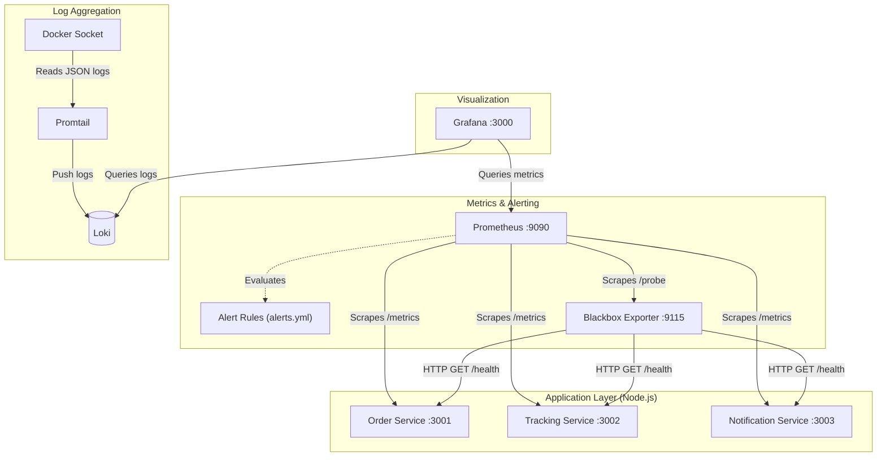

# WatchTower — Observability Stack & Logging Stack (Prometheus + Grafana + Loki)

Reyla Logistics runs three Node.js microservices (`order-service`, `tracking-service`, `notification-service`). This repository implements a  **production-style observability stack** with the three core pillars of observability—Metrics, Alerts, and Logs—using a fully containerized Prometheus, Grafana, and Loki stack with zero-touch automated provisioning.

---

## 1. Architecture diagram (ASCII)



**Flow**

1. Each service exposes **`/metrics`** (Prometheus format) and **`/health`** (JSON).
2. **Prometheus** scrapes `/metrics` on a **15s** interval from all services over the Docker **`observability`** network using **service DNS names** (e.g. `order-service`, not `localhost`).
3. Prometheus also scrapes the **Blackbox Exporter**, which **HTTP checks** on **`/health` oendpoints** to validate real service availability (including non-200 responses).
4. Prometheus evaluates **Alert rules** defined in `prometheus/alerts.yml` based on collected metrics and probe results.
5. **Grafana** connects to Prometheus as a **provisioned datasource** and loads dashboards automatically at startup.
6. (Bonus) Promtail collects container logs and pushes them to Loki, which Grafana queries for log visualization.

> **Why Blackbox?** The coursework asks for alerts when **`/health` is not HTTP 200**. Prometheus’ `up` metric only reflects **successful scrapes of `/metrics`**, so a broken `/health` with a healthy `/metrics` would be invisible. Blackbox closes that gap.

---

## 2. Repository layout

```
WatchTower/
├── docker-compose.yml
├── .env.example
├── blackbox/
│   └── blackbox.yml
├── prometheus/
│   ├── prometheus.yml
│   └── alerts.yml
├── grafana/
│   ├── provisioning/
│   │   ├── datasources/prometheus.yaml
│   │   └── dashboards/watchtower.yaml
│   └── dashboards/
│       └── dashboard.json
└── app/…                     # (unchanged logic)
```

---

## 3. Setup instructions

### 3.1 Prerequisites

- Docker Engine + Docker Compose v2

### 3.2 Clone repo and Launch the stack

```bash
git clone "https://github.com/emmiduh/AmaliTech-DEG-Project-based-challenges"
cd dev-ops/WatchTower
cp .env.example .env
docker compose up --build
```

### 3.3 Verify Prometheus

1. Open **http://localhost:9090** (or `${PROMETHEUS_HOST_PORT}` if you changed it).
2. Navigate to **Status → Targets**.
3. You should see **`order-service`**, **`tracking-service`**, **`notification-service`**, **`blackbox-health`**, and **`prometheus`** in **UP** state (green) after ~30–60 seconds.

**Quick PromQL checks**

- Request traffic: `sum by (job) (rate(http_requests_total[1m]))`
- Health probes: `probe_success{job="blackbox-health"}`

### 3.4 Verify Grafana

1. Open **http://localhost:3000** (or `${GRAFANA_HOST_PORT}`).
2. Sign in with **`GF_SECURITY_ADMIN_USER` / `GF_SECURITY_ADMIN_PASSWORD`** from `.env`.
3. Open **Dashboards → WatchTower Observability** (UID `watchtower-main`). It should appear **without manual import** thanks to provisioning.

---

## 4. Dashboard walkthrough (`grafana/dashboards/dashboard.json`)

| Panel | What it shows | PromQL idea |
| ----- | --------------- | ----------- |
| **HTTP request rate (per service)** | Throughput across all instrumented routes, split by Compose/`job` name. | `sum by (job) (rate(http_requests_total[$__rate_interval]))` |
| **HTTP 5xx error rate (%)** | Percentage of responses whose `status` label matches `5xx` for each `job`. Uses `clamp_min` to avoid divide-by-zero when a service is idle. | `100 * sum(rate(...5xx...)) / clamp_min(sum(rate(...)), 1e-9)` |
| **Service health (Blackbox /health probe)** | Step chart of **`probe_success`** (1 healthy, 0 failing) per `service` label extracted from the probe URL. | `probe_success{job="blackbox-health"}` |
| **Bonus — uptime % (1h rolling)** | Approximate “uptime” as **`avg_over_time(probe_success[1h]) * 100`** for each microservice. Set the Grafana time picker to **Last 24 hours** to read the last day visually. | Three explicit queries for `order-service`, `tracking-service`, and `notification-service`. |

> **Screenshots:** capture your own Grafana views for submissions/portfolios; this README focuses on reproducible configuration.

---

## 5. Alert testing (how to simulate each condition)

All rules live in **`prometheus/alerts.yml`** and are evaluated by Prometheus (view **Alerts** in the Prometheus UI).

### 5.1 `ServiceDown` (critical) — `/health` not HTTP 200 for >1 minute

**Mechanism:** `probe_success{job="blackbox-health"} == 0` for **1m**.

**Simulate**

```bash
# Stop one service; Blackbox and metrics scrapes both fail for that target.
docker compose stop order-service
```

Wait **>1 minute**, then check **Prometheus → Alerts**. Restore with `docker compose start order-service`.

**Alternative:** keep the container running but make `/health` return non-200 **without editing service code** by inserting a reverse proxy or fault-injection sidecar (out of scope here)—stopping the container is the quickest classroom test.

### 5.2 `HighErrorRate` (warning) — >5% 5xx over 5 minutes

**Mechanism:** ratio of `rate(http_requests_total{status=~"5.."}[5m])` over total request rate.

**Simulate**

The sample services mostly emit **2xx/4xx**, not **5xx**, so this alert may not fire during casual browsing.

**Practical options for reviewers:**

- Temporarily lower the threshold in a **local copy** of `alerts.yml` (for example `> 0.0001`) and `docker compose restart prometheus`, **or**
- Add a **temporary** `/chaos/500` route in a throwaway branch (not this protected branch) to emit real 5xx, **or**
- Use **`promtool test rules`** with crafted input series (advanced).

### 5.3 `ServiceNotScraping` (warning) — no metrics scrape for >2 minutes

**Mechanism:** `up{job=~"order-service|tracking-service|notification-service"} == 0` for **2m**.

**Simulate**

```bash
docker compose stop tracking-service
```

After **2 minutes**, Prometheus marks the `tracking-service` target as down (`up==0`) and the alert should move to **pending/firing** depending on timing.

---

## 6. Logging (JSON file driver + commands)

Compose configures the **`json-file`** driver with **rotation** (`max-size`, `max-file`) for every service via YAML anchors.

### 6.1 View live logs (all services)

```bash
docker compose logs -f
```

**Sample output (abridged)**

```text
order-service-1  | {"level":"info","service":"order-service","msg":"Listening on port 3001"}
prometheus-1     | ts=2026-04-23T12:00:00Z caller=main.go level=info msg="Starting Prometheus Server"
grafana-1        | logger=settings t=2026-04-23T12:00:01Z level=info msg="Config loaded from"
```

Each line is wrapped by Docker as JSON (fields such as `log`, `stream`, `time`)—easy to forward to Loki/ELK later.

### 6.2 Filter errors for one service

```bash
docker compose logs order-service | grep -i error
```

**Sample output**

```text
order-service-1  | {"level":"error","msg":"example stack trace ..."}
```

> **Note:** your sample apps primarily log **info** JSON to stdout; the `grep` command is still the standard operator workflow when errors exist.

---

## 7. Bonus — uptime % graph (Option C)

The dashboard’s final panel plots **`avg_over_time(probe_success[1h]) * 100`** per service. Widen the Grafana time range to **Last 24 hours** to reason about day-scale availability. This is an **approximation** of uptime derived from synthetic checks, not billing-grade SLO data.

---

## 8. Key design decisions (short)

| Decision | Why |
| -------- | --- |
| Dedicated **`observability`** bridge network | Stable DNS (`order-service`, `prometheus`, …) and least surprise compared to `default` bridge. |
| **Blackbox** for `/health` | Satisfies “non-200 health” alerting while keeping Node services untouched. |
| **Separate jobs per microservice** | `job` label aligns with Compose service names → simpler `sum by (job)` dashboards. |
| **json-file logging + rotation** | Controls disk growth on laptops/CI runners while preserving structured envelopes for shippers. |
| **Provisioned Grafana** | Eliminates manual datasource/dashboard clicks—matches “production GitOps” workflows. |
| **Alert annotations** | Every alert carries **`summary`** and **`description`** for paging systems and humans. |

---

## 9. Pre-submission checklist (from the brief)

- [ ] `docker compose up --build` succeeds from `dev-ops/WatchTower`
- [ ] `.env.example` committed; real `.env` gitignored
- [ ] Prometheus **/targets** shows microservices **UP**
- [ ] Grafana loads **WatchTower Observability** automatically
- [ ] `prometheus/alerts.yml` present with three alert names and annotations
- [ ] README explains alert testing + logging commands

---

## 10. Original challenge & submission

Upstream course text and submission links may still apply externally. This README is the **solution documentation** for the WatchTower observability work.
